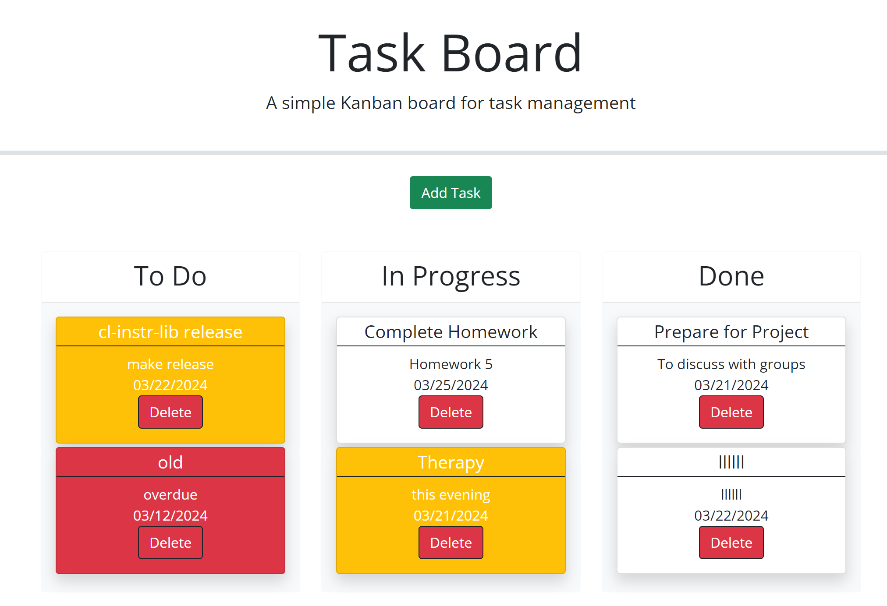

# task-manager
A board for task management

This Kanban board allows the user to create to-do tasks and organize the tasks according to their completion status.

The built application is located: https://kaitlinnowell.github.io/task-manager/

